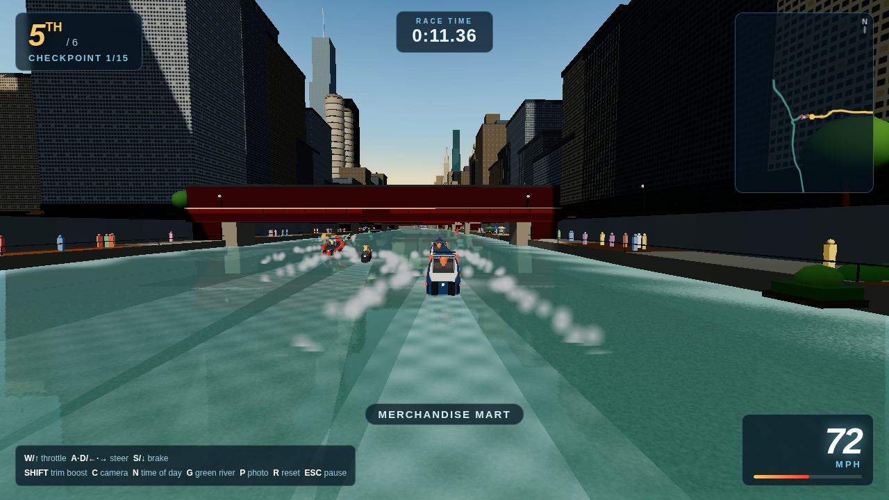

# River Racer — Chicago

Arcade boat racing down the **real Chicago River** and out into **Lake Michigan**, in your browser. No install, no server, no network — pure WebGL.



## Play

**Easiest:** download [`play/RiverRacer.html`](play/RiverRacer.html) and double-click it. The entire game — engine, city, audio, three.js — lives in that one file.

**From the repo:** open `index.html` in any browser.

The river **mirrors the skyline** with real planar reflections, the golden hour **blooms**, boats kick up **bow-wave foam**, and **bascule bridges raise and lower** — gun it under one as its warning horn sounds and gulls scatter off the deck. You **shove rival racers off their line**, **dodge the yellow water taxis and white Wendella tour boats** working the channel, and blast through checkpoint gates to top up your boost. Tap **N** to ride the clock through **day → sunset → night**: the sky burns orange at dusk, then the whole city lights up — thousands of windows and street lamps glowing on the black water, the **Navy Pier wheel** blazing with color-cycling LEDs, and **fireworks** bursting over the pier. Hit **G** to dye the whole river **St. Patrick's-Day green**, or **P** for a cinematic photo-mode orbit. The renderer scales quality dynamically to hold frame rate.

## The map is real

The river isn't game-designer squiggle — the three channels are **medial-axis centerlines extracted from real GIS hydrography** of the Chicago Area Waterway System (IEPA/USGS bank-line data), with channel widths measured from the same survey. All three branches meet at the true Wolf Point junction, and the Main Stem jogs north at Trump Tower exactly like the real river does.

And it's built like the real thing vertically: the river runs in a **trough a full level (~20 ft) below the street grid**, just like Upper Wacker Drive — you race down at water level between tall quay walls, with the Riverwalk promenade at the water's edge and the Loop's dense wall of buildings rising from the street above.

Along the banks, modeled from their actual footprints and heights:

- **Marina City** corncobs, **Willis Tower**'s nine stepped tubes, **Trump Tower**, the **Wrigley Building** clock tower, **Tribune Tower**'s gothic crown, **Merchandise Mart**, **333 W Wacker**'s curved green glass at the bend, **St. Regis**, **Aqua**, the **Jewelers Building** cupolas, **Civic Opera House**, **150 N Riverside** on its impossible base, **River Point**, **Lake Point Tower**, and more — plus landmark callouts as you pass.
- **28 bridges** in their real order, each with its **street-name sign** (WELLS ST, WABASH AVE, LAKE SHORE DR…), cream-limestone tender houses with verdigris roofs, baluster railings and lamp posts: the bascule spans of the Loop, Wells and Lake St double-deckers carrying the L, the DuSable/Michigan Ave bridge with four tender houses, and the **Kinzie St rail bridge permanently saluting the sky**. Several **bascule bridges raise and lower** their leaves on their own cycles.
- The real **multi-level Chicago Riverwalk**: a lower promenade at the water's edge with quay walls and railings, stepped up to the street, threaded with its themed "rooms" — café pavilions under canopies, umbrella plazas, the stepped **River Theater**, floating gardens and kayak docks — plus docked **architecture-tour boats** and water taxis.
- A **living city**: crowds of people and cyclists stroll the promenades and **cars stream across every bridge**, all GPU-instanced. Lamp posts, benches, planters, street trees and pocket parks line the upper level — with strict keep-out so nothing but the bridges ever crosses the water.
- The **Chicago Harbor Lock** (real 24 m chamber — a genuine pinch at speed), a built-out **Navy Pier** — Pier Park, Festival Hall, the domed ballroom, a carousel and string-lit promenade — crowned by the **Centennial Wheel**: a proper Ferris wheel with a double steel rim, hub, and hanging gondolas that spins on its true axle and blazes with color-cycling LEDs at night. Plus the **Chicago Harbor Lighthouse** and a **living harbor**: moored sailboats, yachts under sail, nav buoys, a lake freighter, and the Gold Coast and Museum Campus skylines low on the far shore. Out on the open water, a **glowing chevron ribbon and lit pylons** mark the racing line so you never lose the course.

## Courses

| Course | Water |
|---|---|
| **Main Stem Sprint** | Wolf Point → ten bridges → the lock → finish at the lighthouse |
| **Full River Run** | Goose Island down the North Branch, the full Main Stem, out past the pier |
| **South Branch Charge** | Chinatown → under Willis Tower → the Loop bridges → the lock |
| **Lake Michigan Circuit** | 3 laps of open-water chop between the pier, lighthouse and breakwater |

## Boats

Five hulls with genuinely different physics: a whippy **sport jet ski**, an offshore **V-hull muscle boat**, a screaming **F1H2O tunnel-hull**, a varnished **1947 mahogany runabout**, and the **CFD Marine 7-1** fire boat. Lean into turns, ride the chop, launch off lake swells, manage the trim-boost meter.

## Controls

| Input | Action |
|---|---|
| `W` / `↑` | Throttle |
| `S` / `↓` | Brake / reverse |
| `A` `D` / `←` `→` | Steer |
| `Shift` | Trim boost (watch the meter) |
| `C` | Camera (chase / close / hull) |
| `N` | Time of day (day / sunset / night) |
| `G` | Dye the river green (St. Patrick's Day) |
| `P` | Photo mode (orbit camera, HUD off) |
| `R` | Reset to course |
| `Esc` | Pause |

Gamepad (left stick + triggers) and touch (left half steers, right half throttles) both work.

## Under the hood

- Plain JavaScript + a vendored three.js — classic script tags, works from `file://`
- Custom water shader (analytic swell + scrolling ripple normals, Fresnel sky, sun glitter, bank foam) whose wave field is mirrored on the CPU so hulls actually ride it
- Whole-city geometry merging (one material for every generic tower), adaptive pixel-ratio scaling, shadow camera that follows the player
- 100% procedural WebAudio: five engine timbres, spray, horns, gulls, and a menu synth loop — zero audio files
- AI rivals with racing lines, corner anticipation, rubber-banding and Chicago-appropriate names (say hi to Deep Dish Dre)
- Race data: checkpoints, standings, best times in `localStorage`

## Development

```
npm install          # playwright for the test harness
node tools/screenshot.js          # headless smoke test + screenshots
node tools/deepwarp.js --course=1 # drive a course to the finish, screenshotting
node tools/bake_data.js           # regenerate js/data/chicago.js
node tools/build_singlefile.js    # rebuild play/RiverRacer.html
```
